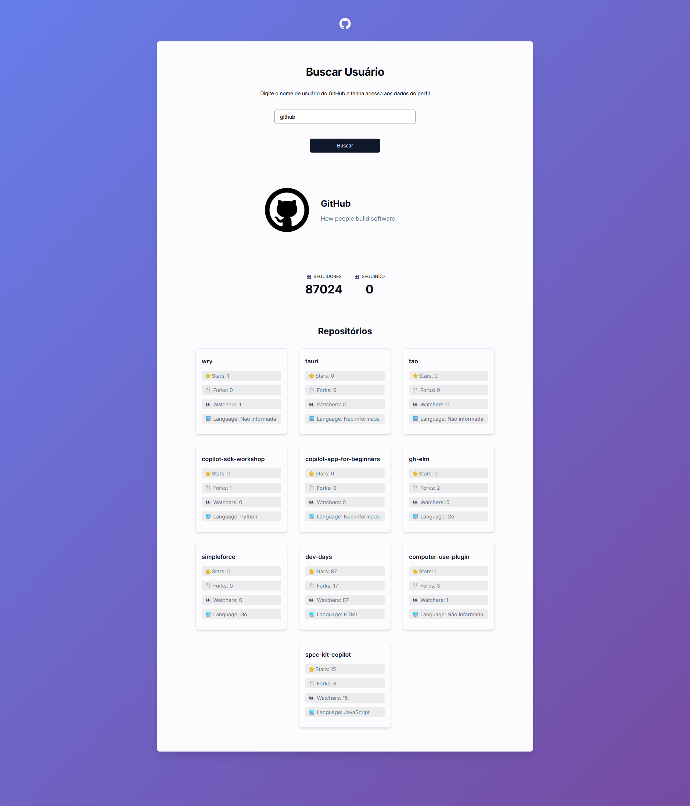

# GitHub Profile Viewer 🔍👤
 
> *Explore any GitHub profile and their latest repositories in real time.*
 
**GitHub Profile Viewer** is a responsive web application that consumes the GitHub REST API to fetch and display user profile details, follower counts, and recent repositories. The project was built with a focus on modular JavaScript architecture (ES Modules), clean asynchronous data fetching, and modern CSS layout techniques.
 
<div align="center">

[](https://0rafae1.github.io/visualizador-perfil-github/)
 
👉 **[Click here for the live demo](https://0rafae1.github.io/visualizador-perfil-github/)** 👈
 
</div>

---
 
## Table of contents
 
- [Overview](#overview)
  - [About the project](#about-the-project)
  - [Screenshot](#screenshot)
  - [Links](#links)
- [My process](#my-process)
  - [Built with](#built-with)
  - [What I learned](#what-i-learned)
  - [Continued development](#continued-development)
  - [Useful resources](#useful-resources)
  - [AI Collaboration](#ai-collaboration)
- [Author](#author)

## Overview
 
### About the project
 
This application provides a clean and intuitive interface for looking up any public profile on GitHub. By typing a username and submitting the form (via button click or the `Enter` key), users can quickly view key profile statistics and browse the user's latest repositories.
 
Users should be able to:
 
- Search for GitHub users using the input field or pressing `Enter`
- View profile information (avatar, display name, username, and bio)
- Check follower and following counters
- Browse the 10 most recently created public repositories with direct links to GitHub
- Inspect repository stats: star count, forks, watchers, and primary language
- See visual loading feedback and error alerts when a user is not found

### Screenshot
 
<p align="center">
  
</p>

### Links
 
- Solution repo: [GitHub repo](https://github.com/0rafae1/visualizador-perfil-github)
- Live Site URL: [Live Preview](https://0rafae1.github.io/visualizador-perfil-github/)

## My process
 
### Built with
 
- **Semantic HTML5:** structured markup using `<main>`, `<section>`, `<header>`, and accessible input controls.
- **Modern CSS3 & Flexbox:** flexible layouts for the container, profile card, counters, and responsive repository grid.
- **CSS Custom Properties (Variables):** centralized color palette, spacing, typography scales, and shadows.
- **CSS Animations & Gradient:** animated vibrant background and smooth transitions on hover states.
- **Vanilla JavaScript (ES6+):** asynchronous calls with `async/await`, `fetch`, and template literals for dynamic HTML injection.
- **Modular Architecture (ES Modules):** clean separation of concerns across dedicated modules (`github-api.js`, `profileView.js`, `profile-renderer.js`).
- **GitHub REST API:** real-time communication with endpoints `/users/{username}` and `/users/{username}/repos`.

### What I learned
 
I learned how to structure a project using **ES Modules** (`import` / `export`), separating API communication, DOM rendering, and event handling into distinct responsibilities:
 
```javascript
// github-api.js - Dedicated API module
export async function fetchGithubUser(userName) {
  const response = await fetch(`${BASE_URL}/users/${userName}`);
  if (!response.ok) {
    throw new Error('Usuário não encontrado.');
  }
  return await response.json();
}
```
 
I also learned how to handle asynchronous flows with `try/catch` while providing user feedback (loading state and alert messages):
 
```javascript
// profile-renderer.js - Loading feedback & error handling
profileResults.innerHTML = `<p class="loading">Carregando...</p>`;

try {
  const userData = await fetchGithubUser(userName);
  const userRepos = await fetchGithubUserRepos(userName);
  renderProfile(userData, userRepos, profileResults);
} catch (error) {
  console.error('Erro ao buscar o perfil do usuário:', error);
  alert('Usuário não encontrado. Por favor, verifique o nome de usuário e tente novamente.');
  profileResults.innerHTML = "";
}
```
 
Finally, I learned how to handle API edge cases gracefully, such as GitHub profiles that don't have a public name or bio configured:
 
```javascript
// profileView.js - Graceful fallbacks
<h2>${userData.name || userData.login}</h2>
<p>${userData.bio || "Não possui bio cadastrada 😢."}</p>
```

### Continued development
  
- [ ] Add pagination or a button to load more repositories
- [ ] Display recent activity/events or pinned repositories
- [ ] Add search debounce or autocomplete
- [ ] Implement a light/dark theme switch

### Useful resources
 
- [GitHub REST API Documentation](https://docs.github.com/en/rest/users/users) - official reference for user and repository endpoints.
- [MDN - JavaScript Modules](https://developer.mozilla.org/en-US/docs/Web/JavaScript/Guide/Modules) - guide on organizing code with `import` and `export`.

### AI Collaboration
 
I used AI as a structured pair programming assistant, focused on learning rather than generating solutions.
 
The AI focused on:
 
- Explaining concepts and reasoning
- Guiding problem-solving through hints and questions
- Reviewing decisions only after my own implementation

All code was written and reviewed by me, using AI strictly as a learning support tool.
 
## Author
 
Built by **Rafael** while studying at **Dev Quest**.
 
- LinkedIn - [Rafael Sousa](https://www.linkedin.com/in/orafael-sousa)
- Frontend Mentor - [@0rafae1](https://www.frontendmentor.io/profile/0rafae1)
- Outlook - [Email](mailto:rafaeltowork@outlook.com)